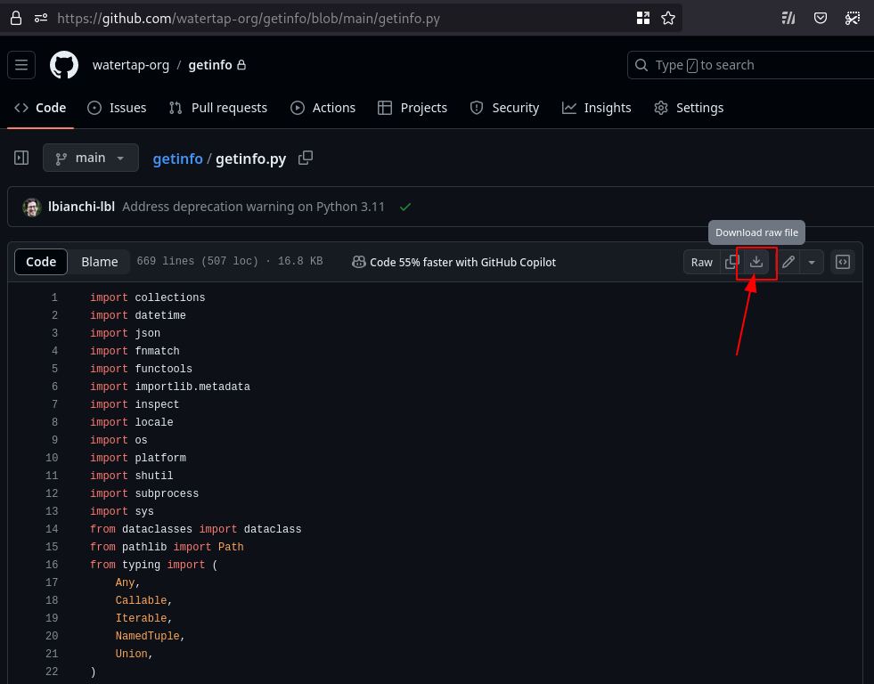
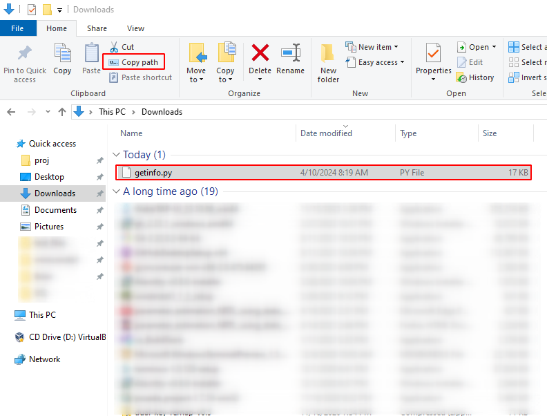
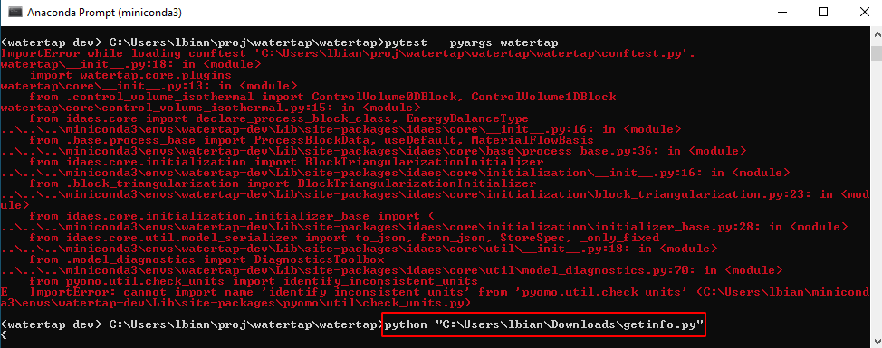
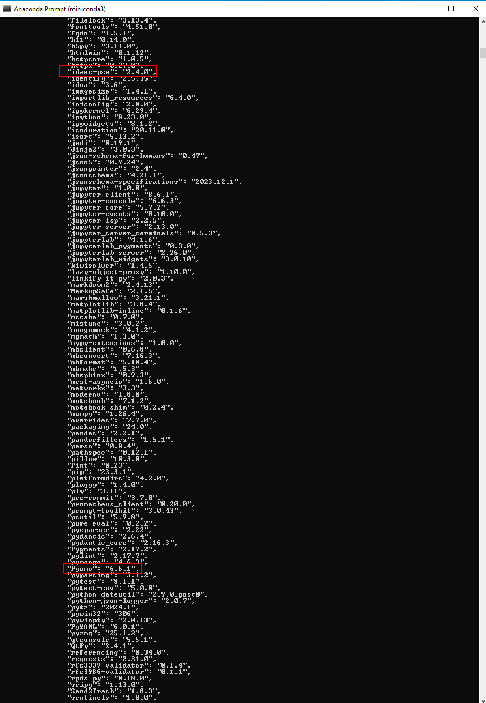

# getinfo

## What is it?

A self-contained script to automatically collect and save various types of information about a computing environment.

```sh
$ python getinfo.py
{
    "module[__main__]": {
        "modulefunction[meta]": {
            "version": "0.24.1.25",
            "__file__": {
                "path": "/home/user/watertap/getinfo/getinfo.py",
                "resolved": "/home/user/watertap/getinfo/getinfo.py",
                "ctime": "2024-04-09T12:08:08.013806",
                "mtime": "2024-04-09T12:08:08.013806",
                "size": 17239
            }
        },
        "modulefunction[python]": {
            "sys.executable": "/opt/conda/envs/dev-watertap-py311/bin/python",
            "which python": {
                "invoked_as": "python",
                "file": {
                    "path": "/opt/conda/envs/dev-watertap-py311/bin/python",
                    "resolved": "/opt/conda/envs/dev-watertap-py311/bin/python3.11",
                    "ctime": "2024-03-05T10:55:51.026118",
                    "mtime": "2024-03-05T10:55:47.902068",
                    "size": 24625680
                }
            },
            "sys.version_info": [
                3,
                11,
                8,
                "final",
                0
            ],
        },
        "modulefunction[platform]": {
            "locale.getlocale()": [
                "en_US",
                "UTF-8"
            ],
            "locale.getpreferredencoding()": "UTF-8",
            "platform.platform()": "Linux-5.4.0-174-generic-x86_64-with-glibc2.31",
            "platform.system()": "Linux",
            "platform.machine()": "x86_64",
            "platform.processor()": "x86_64",
            "platform.version()": "#193-Ubuntu SMP Thu Mar 7 14:29:28 UTC 2024",
            "platform.release()": "5.4.0-174-generic",
# truncated, full output is longer
```

## What (and whom) is it for?

The primary use case for **getinfo** is to make collecting, sharing, and comparing information easier while troubleshooting.

For example, when supporting a user who's reporting an issue, a WaterTAP developer/maintainer might need to ask a number of question, including:

- What version of WaterTAP are you using?
- What version of IDAES/Pyomo is installed?
- Did you install WaterTAP from PyPI? A local Git clone? A GitHub branch/fork?
- Are you using a Conda environment?
- What version of Python are you using?
- What's the path of the Python executable?
- What was the working directory when the issue occurred?
- What operating system are you using? What version?
- What processor architecture?
- What other Python packages are installed? What versions?

**getinfo** makes this process easier, by:

- Automating the collection of information (as opposed to the maintainer having to provide the commands to run, and the user having to run them)
- Collating the output in a standardized text format, so that e.g. outputs from different environments can be compared (or even `diff`ed) directly

## How do I install getinfo?

To use **getinfo**, no installation is necessary (or, for the time being, even supported). **getinfo** is designed to be as self-contained as possible: the only requirements are (a) a local copy of the `getinfo.py` file, and (b) a working `python` command.

## How do I use getinfo?

For the sake of example, let's consider the scenario in which you encounter an issue, e.g. an unexpected failure while running WaterTAP's test suite.

1. Download `getinfo.py` by navigating to <https://github.com/watertap-org/getinfo/blob/main/getinfo.py> and clicking on the "Download raw file" button
  
2. Copy the path of the downloaded `getinfo.py` file (e.g. on Windows, this can be done by navigating to the `Downloads` folder, selecting the file, and clicking on "Copy Path")
  
3. In the same terminal/console window where the failure occurred, type `python `  followed by the path to the downloaded `getinfo.py` file, e.g. `python "C:\Users\user\Downloads\getinfo.py"`. If the terminal/console window isn't open anymore, open a new one trying to reproduce the conditions when the failure occurred (e.g. same working directory, Conda environment, etc)
  
4. After collecting various types of information, **getinfo** will save the collected data in JSON format. By default, the output is saved to a JSON file in the current working directory (the name is displayed in the logging), which can be opened with any text editor and/or attached to e.g. a GitHub issue or a Slack support message. In this particular example, inspecting the **getinfo** output would help an experienced developer spot an incompatibility between the installed versions of `Pyomo` and `idaes-pse` (the `Pyomo` version is too old)
  
